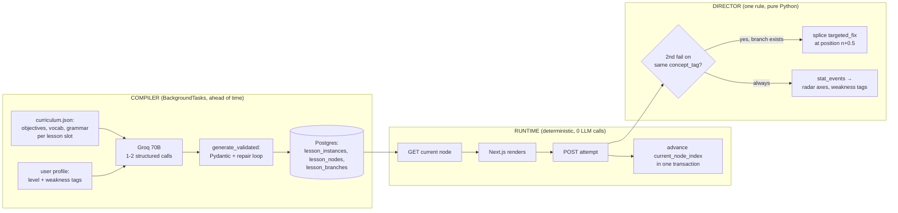

# Buslingo Backend: The Definitive Implementation Blueprint (Portfolio Edition)

**Audience:** This document is an implementation brief for an AI coding agent (and its human operators). It is prescriptive, not exploratory. Where it says "do X," do X. Where it says "do NOT do Y," the Y was considered by the architect and rejected for reasons stated inline — do not reintroduce it "as an improvement."

**Project reality constraints (these override any general best practice you know):**
- Team: 3 students, learning as they build. Code must be readable and boring, not clever.
- Budget: **$0.** Groq free tier (LLM + Whisper STT), Supabase free tier (Postgres + Auth), Vercel free (frontend), Render/Railway free (FastAPI). TTS strategy defined in §7.
- Deployment: **exactly one Uvicorn worker, one process.** All architectural decisions below assume single-process. Do not add Redis, Celery, message brokers, or any multi-process coordination. In-process Python state + Postgres + FastAPI `BackgroundTasks` cover everything.
- Scale target: tens of users, not thousands. Optimize for reliability and demo polish, never for throughput.
- Frontend already exists (Next.js 16 / React 19 / Tailwind 4 / Framer Motion) as a state-driven view layer. The backend described here drives it.

**Stack (final, do not substitute):** FastAPI (Python 3.11+) · Supabase (Postgres + Auth) · Groq (`llama-3.3-70b-versatile` for generation, `llama-3.1-8b-instant` where marked, `whisper-large-v3-turbo` for STT) · httpx (async) · Pydantic v2 · FastAPI BackgroundTasks.

---

## FOR THE HUMANS: Plain-Language Summary (read this before anything else)

*Everything below this section is written for the AI IDE — dense and prescriptive. This section is for us, the team, so we all understand what we're building and can tell when the AI IDE goes off-script.*

**The one big idea.** Our app never makes the AI think while the user is waiting. When a user finishes lesson 2, the backend quietly asks Groq to write *all of lesson 3* — every theory text, every quiz, every wrong-answer explanation, even the "rescue" mini-lessons for when they mess up — and saves it in the database. When they click lesson 3, it's already there. So every screen loads instantly, the progress bar always works, and if the browser crashes mid-lesson, the lesson is safe in Postgres and they resume exactly where they stopped. The three parts have names: the **Compiler** (writes lessons ahead of time), the **Runtime** (serves them — dumb, fast, no AI), and the **Director** (literally one `if` statement: failed the same question twice → insert the pre-written Quick Fix). To the user, the Quick Fix looks like a live tutor noticing them struggle. The noticing was just precomputed.

**How it stays free.** Groq's free tier allows ~30 requests/minute, so every AI feature is sorted into three buckets: generated ahead of time (all lesson content + wrong-answer explanations), generated once and shared by every user (vocabulary definitions and example sentences), and truly live (voice conversation, essay grading, QnA, coach summary). A whole lesson session makes the user *wait* on the AI only once or twice. Voice TTS: try Groq's hosted TTS → fall back to the browser's free built-in voice → save our ~10 free ElevenLabs minutes for the demo video.

**Important: the app is NOT canned — users can ask anything, anytime (§5.5).** Only the *lesson material* is pre-generated. A chat drawer is available on every screen where the user asks literally any question and gets a live AI answer grounded in the current lesson — questions are never predetermined. Three soft zones: on-topic → full answer; related-but-outside-this-lesson → short answer + steer back; totally random → one friendly line + steer back (never a rude "that's off topic"; after a couple of random ones in a row, it *offers* — never forces — a quick review question instead). And the clever bit: if a user asks about the same concept twice, the system treats it like failing a quiz on it and inserts the pre-built Quick Fix drill — so the user's questions genuinely shape the lesson, but through a simple rule, not an AI making flow decisions (which would bring back spinners and unreliability).

**The book question (still undecided — and that's fine).** Whether we end up with a 500-page textbook, a 44–45 lesson coursebook, some random book, or no book at all, **the backend never reads a book.** It only reads one file: `curriculum.json`, which lists what each lesson should teach (objectives, vocab, grammar, phrases). If we get a structured 44-lesson book, a small script extracts each book lesson into that file once, and the book's own order becomes our unit map. If we get a big messy book, same script, we just decide the lesson boundaries ourselves first. If we get no book, we write the JSON ourselves with AI help. Zero backend code changes in any scenario — the book is a content decision, not an engineering decision. (Also: we generate original lessons *grounded in* the book's topic lists; we never copy book text into the app.)

**Voice.** We build the "walkie-talkie" version: tap mic, talk, AI replies with voice. ~200 lines, no WebSockets, demos great. The fancy real-time interruption version is fully designed in §7.3 as a v2 roadmap — deferring it is a deliberate, documented decision (and a good interview talking point), not a gap.

**The most important 60 lines.** `generate_validated()` — every AI call declares a strict schema; if Llama returns broken JSON, we show the model its own error and it fixes it (~90% success); if everything fails, the user sees "your coach is taking a closer look…" and it retries in the background. Users never see errors. Every failure is logged to a table so we can see when a prompt change broke things.

**The plan (build in this order, don't skip):** Phase 1 = the whole clickable lesson flow with hand-written fake lessons and **zero AI code** — proves database + endpoints first. Phase 2 = the Compiler + Quick Fix injection (fake lessons become generated ones). Phase 3 = writing grading, QnA, radar chart, SRS flashcards. Phase 4 = voice + polish + README + demo video. Each phase is demoable when it's done.

**How to drive the AI IDE:** feed it this whole file, then say "implement Phase 1 only." Test every endpoint yourself in FastAPI's `/docs` page before moving on. If the IDE tries to add Redis, LangChain, Celery, or WebSocket voice in v1 — it's off-script; those are explicitly forbidden below, with reasons.

---

## 0. The Architecture in One Paragraph

Buslingo uses a **Compiler → Runtime → Director** pattern. The **Compiler** is an asynchronous pipeline that generates a complete, personalized lesson (a "lesson bundle": an ordered spine of nodes plus pre-generated remediation branches) in 1–2 Groq calls and persists it to Postgres **before the user needs it** — triggered when the previous lesson completes, or on first click with a progressive cold-start. The **Runtime** is a deterministic state machine that serves pre-compiled nodes one at a time and advances a server-side cursor; screen transitions never call an LLM. The **Director** is a rules engine (a plain `if` statement, not an LLM) that fires on node-completion events and may inject a pre-compiled Targeted Fix node into the spine when the user struggles. Real-time LLM calls happen in exactly four places: voice conversation turns, writing assessment grading, freeform QnA, and the end-of-lesson coach summary. Everything else is compile-time or pure backend math.

Why this pattern is non-negotiable for this project: Groq's free tier allows roughly 30 requests/minute. An agent-orchestrated design (LLM decides each screen transition) exhausts that with ~3 concurrent users and puts a 500–900ms spinner between every screen. A fully static design can't adapt. This pattern gives zero-latency transitions, working progress bars, trivial crash recovery, AND visible adaptivity — while making ~2 user-facing blocking LLM calls per lesson session.



---

## 1. Pillar 1 — Lesson Orchestration (the resolved dilemma)

### 1.1 Decision record: why not an agent, why not static

**Approach A (autonomous agent orchestrating each transition) is rejected.** Reasons, in priority order for THIS project: (a) free-tier rate limits — every screen transition consumes a request from a ~30/min budget; (b) latency — 500–900ms spinner between every node; (c) non-resumability — lesson state lives in an LLM transcript, so a browser crash means replaying the transcript and possibly getting *different* decisions; (d) reliability — tool-call schema breaks compound across 12+ decision calls per lesson; (e) untestability — there is no lesson artifact to write tests against.

**Approach B (static pre-generation) is 80% adopted.** Its sole weakness — no adaptation when a user bombs a node — is fixed not by making decisions dynamic but by **pre-generating the failure branches too.** Adaptation *content* is compiled; adaptation *decisions* are deterministic rules.

**Do not use a graph database.** Access patterns are "node at position p for instance X" and "branch for tag T" — B-tree lookups. Postgres handles this. **Do not pre-generate a full decision tree** — exponential compile cost for paths never taken, and deep branches go stale as the profile evolves.

### 1.2 The lesson bundle contract

The Compiler emits, and the Runtime consumes, this exact structure (Pydantic models in §6.2 are the source of truth):

```json
{
  "title": "Handling Pushback in Client Meetings",
  "spine": [
    {"node_type": "theory", "concept_tag": "polite_disagreement",
     "content": {"markdown": "## Disagreeing professionally\n..."}},
    {"node_type": "mcq", "concept_tag": "polite_disagreement",
     "content": {
       "question": "Your client rejects your proposal in a meeting. The most professional first response is:",
       "options": ["That's wrong.", "I hear your concern — may I explain the reasoning?",
                   "Fine, whatever you prefer.", "Let me escalate this to my manager."],
       "correct_index": 1,
       "explanations": {
         "0": "Direct contradiction ('That's wrong') reads as hostile in business English...",
         "2": "'Fine, whatever' signals disengagement and damages your credibility...",
         "3": "Escalating immediately skips the negotiation step and..."}}},
    {"node_type": "voice", "concept_tag": "polite_disagreement",
     "content": {"scenario": "You are meeting a client, Ms. Park, who wants a 30% discount...",
                 "ai_persona": "Ms. Park: firm but professional procurement lead",
                 "objectives": ["Acknowledge her position", "Hold your price with a counter-offer",
                                "Use at least two softening phrases"],
                 "opening_line": "Thanks for coming in. Let me be direct — your pricing is too high."}},
    {"node_type": "writing", "concept_tag": "tone_formality",
     "content": {"scenario": "Write a follow-up email to Ms. Park summarizing the compromise...",
                 "min_words": 60}}
  ],
  "branches": {
    "polite_disagreement": {
      "content": {"micro_theory": "The three-part pushback formula: Acknowledge → Bridge → Assert...",
                  "drill_mcq": {"question": "...", "options": ["...","...","...","..."],
                                "correct_index": 2, "explanations": {"0":"...","1":"...","3":"..."}}}}
  }
}
```

Non-obvious requirements baked into this contract — the AI IDE must preserve all of them:
- **Every MCQ carries `explanations` for ALL wrong options, generated in the same compile call.** This is the single biggest API-call reduction in the whole system: wrong-answer feedback becomes a dict lookup, never an LLM call.
- **Every node carries a `concept_tag`** drawn from the canonical list in `curriculum.json` (§3.2). Freetext tags are forbidden — canonical tags are what make the Director's branch matching and the weakness-tracking system work.
- **One branch per concept tag per lesson**, containing a `micro_theory` + one `drill_mcq`. Small on purpose: branches add ~30% to compile tokens, not 300%.
- The **voice node includes `opening_line`** so the AI speaks first — this sidesteps the awkward "both waiting" cold open and gives the TTS something to do during the node's intro animation.

### 1.3 Compile timing

- **Steady state:** inside `POST /lesson-instances/{id}/complete`, after the transaction commits, `background_tasks.add_task(compile_lesson, user_id, next_slot_id)`. By the time the user clicks the next lesson (minutes to days later), it is `status='ready'` in Postgres. Perceived generation latency: zero.
- **Cold start** (first lesson after placement, or user skips ahead): `POST /lessons/{slot_id}/start` finds no instance → creates one with `status='compiling'`, fires the compile as a background task, and returns `202 {status:"compiling"}`. The frontend shows "Personalizing your lesson…" and polls `GET /lesson-instances/{id}` every 1.5s. Groq compiles a full bundle in ~3–6s, so the user waits once, briefly, behind an honest animation. **Do not build token-streaming partial-node delivery for v1** — polling a background compile is 10 lines and indistinguishable to the user at these speeds. (Streaming node-1-first is a v2 optimization; leave a TODO.)
- **Recompile guard:** the `unique (user_id, lesson_slot_id)` constraint plus a status check makes double-compiles impossible even if the user double-clicks Start: `INSERT ... ON CONFLICT DO NOTHING`, then `SELECT` the winner.

### 1.4 The Director: exactly one rule in v1

Implemented as a pure function called inside the attempt transaction (§5.3):

> **IF** this attempt is incorrect **AND** it is the 2nd (or later) failed attempt on this node **AND** a branch exists for this node's `concept_tag` **AND** that branch is not yet consumed **AND** injected-node count for this instance < 2 → **THEN** insert the branch's content as a `targeted_fix` node at `position = current_position + 0.5`, mark the branch consumed, and return the injected node in the attempt response.

Everything is deterministic, transactional, and sub-millisecond. The frontend receives `{"correct": false, "explanation": "...", "injected_node": {...}}` and renders the "⚡ Quick Fix" card via the existing `TargetedFixCard.tsx`. In a demo, this looks exactly like a live AI tutor noticing the struggle — because pedagogically, it is; the noticing is just precomputed. **A second signal source feeds the same injection mechanism: repeated user questions on one concept (Director rule #2, §5.5).**

**Progress bar semantics (frontend contract):** the denominator is the spine only. `progress = completed_spine_nodes / total_spine_nodes`. Injected fixes display as a chip and never move the bar backward. The bar is monotonically increasing — this invariant must never break.

**Cross-lesson adaptation (free, and where the real pedagogy lives):** every attempt writes to `stat_events`; a rolling per-concept accuracy updates `user_profiles.weakness_tags`. The next compile call receives those tags and biases lesson content toward them. This loop — struggle in lesson N, see it addressed in lesson N+1 — is the product's signature move. Make sure the coach summary (§8) explicitly names what the next lesson will focus on, so users *notice* the loop.

---

## 2. Pillar 2 — LLM Call Economy on the Free Tier

### 2.1 The three-tier sort (every AI touchpoint, classified)

| Interaction | Tier | Mechanism |
|---|---|---|
| Lesson title + all node content | **1: Compile-time** | 1–2 Groq calls per lesson, background |
| MCQ wrong-answer explanations | **1: Compile-time** | Generated inside the MCQ, dict lookup at runtime — **zero JIT calls** |
| Targeted Fix branches | **1: Compile-time** | Part of the bundle |
| SRS context sentences / definitions | **2: Cached globally** | Generated once into `vocab_terms` by a seed script (§9.4), shared by all users, no per-user generation |
| QnA answers ("Ask Anything" layer, §5.5) | **3: JIT, fully live** | The user asks literally anything, any time, on any node. One Groq call returns a structured `{answer, scope, related_concept_tag}` — grounded in current node + slot context. **User questions are never preloaded or predetermined.** NO semantic cache in v1 (needs ~50 users/lesson to pay off). Rarely (+≤2/lesson, Director rule #2 branch-miss), one extra call JIT-mints a drill MCQ from the user's questions (§5.5) |
| Voice turns | **3: JIT** | Irreducible; see §7 |
| Writing grade | **3: JIT** | One `generate_validated` call per submission |
| Coach summary | **3: JIT, async** | Fired via BackgroundTasks at completion; frontend polls while confetti plays |

**Per-lesson-session request budget** (the number that keeps you inside Groq's ~30 req/min free tier): 1–2 compile (background) + ~10–16 voice turns (each = 1 Whisper + 1 LLM, spread over 5 minutes ≈ 4–6 req/min) + 1 writing grade + 0–3 QnA + 1 summary. A single active user peaks at ~8 req/min during voice; **three simultaneous demo users fit within the free tier.** If a 429 arrives anyway, the client-level retry (§6.1) absorbs it invisibly.

### 2.2 Pre-generation policy

**Compile exactly one lesson ahead of the user's frontier — never the whole curriculum.** Rationale: (a) lesson N+1 should consume weaknesses discovered in lessons 1..N — pre-generating everything at signup produces a static course wearing an AI skin, destroying the product's thesis; (b) it wastes the token budget on lessons a churned user never opens. The only signup-time compile is Unit 1 Lesson 1, triggered when the level is chosen.

### 2.3 Knowledge grounding: curriculum.json as the universal adapter (book or no book)

**The source of the curriculum is currently undecided** — it may end up being a 500-page textbook, a structured coursebook with ~44–45 predefined lessons, several sources mixed, or no book at all. The architecture must not care. Therefore the design rule is:

> **The backend never reads a book. The backend reads only `app/content/curriculum.json`.** Whatever source the team eventually picks gets converted *into* that file by an offline ingestion step. The compile prompt, the schemas, the Director, and every route are identical in all scenarios.

`curriculum.json` is the canonical intermediate format — the single source of pedagogical truth. Per lesson slot it holds: objectives, `concept_tags`, key vocabulary, grammar points, and example phrases (structure below). The three ingestion paths into it:

| Scenario | Ingestion path | Effort |
|---|---|---|
| **No book (default / fallback)** | Author the JSON directly with AI assistance + human review. ~40 lines per slot. | Lowest — start here regardless, so Phase 2 is never blocked on a book decision |
| **Structured coursebook (~44–45 predefined lessons)** | The best case. Map book lessons 1:1 onto `lesson_slots` (44 lessons ≈ 10–11 units × 4). Per book lesson, run a one-time extraction prompt: paste the lesson's text → `generate_validated(SlotContext)` → a slot entry. A `scripts/ingest_book.py` loops this over the whole book in an afternoon. The book's own sequence *becomes* the scaffold — do not invent a different unit structure on top of it. | One script + one review pass |
| **500-page unstructured textbook** | Same extraction script, but chapters → units and you (humans) decide the slot boundaries first. **Still no vector store in v1** — extraction-to-JSON beats RAG here because it is reviewed once, deterministic forever, and free. Full pgvector RAG (chunk + embed + retrieve at compile time) is the v2 path, and only becomes worth it if content is too large or too fluid to extract once. |
| A different/random book later | Re-run the ingestion script on the new source; the output format is the same file. Nothing downstream changes. |

Because ingestion is offline and one-time, **copyright stays manageable too**: the compiled lessons are AI-generated original content *grounded in* extracted objectives/vocab lists, not reproductions of book text. Do not paste book passages into `lesson_nodes` content verbatim.

The extraction schema (used by `scripts/ingest_book.py`, validated by the same `generate_validated` house pattern):

```python
class SlotContext(BaseModel):
    objectives: list[str] = Field(min_length=2, max_length=5)
    concept_tags: list[str]              # validator: canonical list only
    key_vocabulary: list[str] = Field(min_length=4, max_length=12)
    grammar_points: list[str] = Field(min_length=1, max_length=4)
    example_phrases: list[str] = Field(min_length=2, max_length=8)
```

The target format it produces:

```json
{
  "concept_tags": ["polite_disagreement", "tone_formality", "tense_past_perfect",
                   "email_structure", "meeting_vocabulary", "negotiation_phrases",
                   "conditionals", "active_listening_phrases", "small_talk",
                   "clarifying_questions", "numbers_and_dates", "closing_language"],
  "units": [
    {"position": 1, "title": "Professional Introductions", "slots": [
      {"position": 1,
       "objectives": ["Introduce yourself and your role", "Ask professional small-talk questions"],
       "concept_tags": ["small_talk", "tone_formality"],
       "key_vocabulary": ["colleague", "department", "responsible for", "based in"],
       "grammar_points": ["Present simple for roles: 'I manage...'",
                          "Polite question forms: 'Could you tell me...'"],
       "example_phrases": ["It's a pleasure to meet you.", "What does your role involve?"],
       "node_template": {
         "beginner":     ["theory", "mcq", "mcq", "voice"],
         "intermediate": ["theory", "mcq", "voice", "writing"],
         "advanced":     ["mcq", "voice", "writing"]}}
    ]}
  ]
}
```

The compile prompt receives the relevant slot object verbatim. This is deterministic, debuggable, versionable in git, and free — strictly better than RAG at this scale. The `concept_tags` array is the closed vocabulary enforced by Pydantic validators everywhere (§6.2). **Access always goes through one function — `get_slot_context(slot_id)` — which is the swap point for every future scenario:** today it reads `curriculum.json`; in v2 it could return pgvector-retrieved book chunks; the compile prompt never changes either way.

**Seed 2 units × 3 lessons for v1, regardless of the final book decision.** Six polished slots demo better than forty-four thin ones. If the 44–45 lesson coursebook is adopted, the ingestion script fills the remaining slots later without touching any code — expanding the curriculum becomes a content task, not an engineering task. (The `units`/`lesson_slots` tables and the seed script already handle any count.)

### 2.4 Context compression: the profile object

Raw history never enters a prompt. The Director maintains a compressed profile (~120 tokens) read fresh from Postgres before every compile/voice/grading call:

```json
{"level": "intermediate", "coach_voice": "direct_professional",
 "weak": [{"tag": "tense_past_perfect", "acc": 0.42}, {"tag": "tone_formality", "acc": 0.55}],
 "strong": ["meeting_vocabulary"],
 "recent_errors": ["chose overly casual option twice in tone MCQs"]}
```

Weakness score = rolling accuracy per concept_tag over the last 20 `stat_events` for that tag; a tag enters `weak` below 0.6 accuracy with ≥3 samples. Pure SQL + Python, no LLM.

### 2.5 Frameworks: prohibited list

**Do not add LangChain, LlamaIndex, CrewAI, or any agent/chain framework.** The project has four narrow, schema-critical LLM tasks; frameworks add version churn, opaque prompt mutation, and un-debuggable call stacks — fatal for a learning team. The entire AI layer is ~350 lines the team owns:

```
app/ai/
  client.py       # async Groq wrapper: timeout, 429 backoff w/ retry-after, semaphore(4)
  schemas.py      # Pydantic: LessonBundle, MCQContent, WritingRubric, CoachSummary, VoiceScore
  generate.py     # generate_validated(messages, schema, model, max_repairs=2)
  prompts/
    compile.py    # COMPILE_SYSTEM_V1, template functions returning message lists
    grade.py      # GRADE_SYSTEM_V1
    voice.py      # VOICE_SYSTEM_V1 (per coach_voice variants)
    summary.py    # SUMMARY_SYSTEM_V1
app/content/
  curriculum.json
```

Prompts live in plain Python files with a `_V1` version suffix; when a prompt changes, bump the suffix and record it on generated rows (`lesson_instances.compile_version`). This makes "content got weird after Tuesday" answerable with one SQL query.

---

## 3. Pillar 3 — API Surface (complete route map)

**19 REST routes + 1 WebSocket (v2 only).** Single FastAPI app, routers per domain: `auth.py`, `dashboard.py`, `lessons.py`, `srs.py`, `qna.py`, `voice.py`, `ops.py`.

### Auth — Supabase Auth does the heavy lifting
The frontend talks to Supabase directly for signup/login/refresh. FastAPI **only verifies** the Supabase JWT: a `get_current_user` dependency that validates the token against the project's JWT secret (HS256 — read `SUPABASE_JWT_SECRET` from env) and yields `user_id`. **Delete the existing custom JWT/password-hashing code entirely; do not migrate it.**

| Route | Behavior |
|---|---|
| `POST /api/auth/sync` | Idempotent post-signup hook: upsert `user_profiles` row from the verified JWT |
| `GET  /api/me` | Profile + settings + streak + XP totals — one call feeds `TopNav.tsx` |
| `PATCH /api/me/settings` | `coach_voice`, `timezone`, `daily_goal_min`, `level` (level dropdown replaces the placement test in v1 — a full adaptive placement flow is v2) |

### Dashboard & curriculum
| `GET /api/dashboard` | One aggregate: `{daily_goal: {minutes, target}, streak: {count, week_days}, next_lesson, srs_due_count}` — one round-trip for the whole `/home` page |
| `GET /api/curriculum` | Units → slots with per-user status: `completed` (instance completed) / `in_progress` / `available` (previous slot completed, or first slot) / `locked` |
| `GET /api/progress` | `{radar: {writing, listening, grammar, vocabulary, tone, fluency}, activity: [{day, minutes, xp}] x 7}` |

### Lesson runtime
| `POST /api/lessons/{slot_id}/start` | Get-or-create instance. `ready` → mark `in_progress`, return instance + current node. Missing → create `compiling`, fire background compile, return 202 |
| `GET  /api/lesson-instances/{id}` | Status + progress `{completed_spine, total_spine}` — this is both the compile-poll endpoint and the crash-resume entry |
| `GET  /api/lesson-instances/{id}/nodes/current` | Full content of the node at the cursor (including an injected fix at a fractional position) |
| `POST /api/lesson-instances/{id}/nodes/{node_id}/attempt` | The workhorse. Body: `{answer_index}` (mcq/fix) or `{read_ack: true}` (theory). Response: `{correct, explanation?, injected_node?, advance_to?, progress}` |
| `POST /api/lesson-instances/{id}/writing/submit` | Body `{draft}` → §8 pipeline → full rubric JSON (~2–4s; the one honest spinner) |
| `POST /api/lesson-instances/{id}/voice/turn` | v1 walkie-talkie voice: multipart audio blob → transcript + reply text + reply audio (§7.2) |
| `POST /api/lesson-instances/{id}/voice/finish` | Ends the voice node → fires async scoring → advances cursor |
| `POST /api/lesson-instances/{id}/complete` | Transaction: status, idempotent XP, activity/streak upsert; then BackgroundTasks: compile next slot + generate coach summary |
| `GET  /api/lesson-instances/{id}/summary` | Poll: `{status: "pending"}` → `{status: "ready", summary, prioritized_fixes, scores}` |

### QnA (1) — `POST /api/lesson-instances/{id}/qna` body `{question}`; the Ask-Anything layer, full design in §5.5. Live Groq call grounded in the current node + slot context; returns `{answer_markdown, scope, related_concept_tag, injected_node?}` — yes, a question can trigger a Quick Fix injection through the Director, same as a failed MCQ. Available on every node, not a node type. Voice questions arrive as text: the frontend records, sends the blob to `POST /api/transcribe` (below), then calls this route.

### Utility (2) — `POST /api/transcribe` (audio blob → Groq Whisper → text; shared by QnA mic + voice v1) · `GET /api/health` (returns `{ok, active_compiles, groq_reachable}`)

### SRS (3) — `GET /api/srs/due` · `POST /api/srs/reviews` (batch `[{card_id, rating}]` → SM-2 §4.3) · `GET /api/srs/stats`

### WebSocket (v2 only, do not build in v1) — `WS /ws/voice/{instance_id}/{node_id}` full-duplex streaming voice with barge-in (§7.3). The v1 REST voice route must be built behind a `VoiceTurnService` interface so this slots in without touching lesson logic.

**Background jobs (BackgroundTasks, not routes, no worker infra):** `compile_lesson(user_id, slot_id)` · `generate_coach_summary(instance_id)` · `score_voice_session(instance_id, node_id)`. Each wraps its body in try/except that writes failures to the `llm_failures` table (§6.4) — a background task that raises silently vanishes, which is the #1 debugging trap with BackgroundTasks.

---

## 4. Pillar 4 — Supabase Schema (complete DDL)

Design law: **the fixed scaffold (`units`, `lesson_slots`) is global and content-free; all generated or user-owned data hangs off `lesson_instances`.** Content persists at compile time, therefore resume is always a read, never a regeneration.

```sql
-- ============ IDENTITY ============
create table user_profiles (
  user_id        uuid primary key references auth.users(id) on delete cascade,
  display_name   text,
  level          text not null default 'beginner'
                 check (level in ('beginner','intermediate','advanced')),
  coach_voice    text not null default 'balanced'
                 check (coach_voice in ('encouraging','direct_professional','balanced')),
  timezone       text not null default 'UTC',
  daily_goal_min int  not null default 20,
  weakness_tags  jsonb not null default '[]',
  strength_tags  jsonb not null default '[]',
  created_at     timestamptz default now()
);

-- ============ FIXED SCAFFOLD (seeded from curriculum.json by scripts/seed.py) ============
create table units (
  id serial primary key,
  position int unique not null,
  title text not null
);
create table lesson_slots (
  id serial primary key,
  unit_id int not null references units(id),
  position int not null,
  slot_key text unique not null,          -- 'u1l1' → lookup key into curriculum.json
  unique (unit_id, position)
);

-- ============ PER-USER GENERATED CONTENT ============
create table lesson_instances (
  id uuid primary key default gen_random_uuid(),
  user_id uuid not null references auth.users(id),
  lesson_slot_id int not null references lesson_slots(id),
  title text,
  status text not null default 'compiling'
         check (status in ('compiling','ready','in_progress','completed','failed')),
  current_node_index numeric not null default 0,   -- ★ THE RESUME CURSOR ★
  compile_version text,                            -- e.g. 'compile_v1' + model name
  profile_snapshot jsonb,                          -- profile used at compile time (debugging gold)
  started_at timestamptz, completed_at timestamptz,
  created_at timestamptz default now(),
  unique (user_id, lesson_slot_id)                 -- ★ double-compile guard ★
);

create table lesson_nodes (
  id uuid primary key default gen_random_uuid(),
  lesson_instance_id uuid not null references lesson_instances(id) on delete cascade,
  position numeric not null,        -- numeric, not int: injected fix between 2 and 3 = 2.5
  node_type text not null check (node_type in
    ('theory','mcq','voice','writing','targeted_fix')),
  is_injected bool not null default false,
  concept_tag text,
  content jsonb not null,           -- full compiled payload incl. all distractor explanations
  status text not null default 'pending'
         check (status in ('pending','completed','skipped')),
  unique (lesson_instance_id, position)
);

create table lesson_branches (      -- pre-compiled remediation, invisible until injected
  id uuid primary key default gen_random_uuid(),
  lesson_instance_id uuid not null references lesson_instances(id) on delete cascade,
  concept_tag text not null,
  content jsonb not null,
  consumed bool not null default false,
  unique (lesson_instance_id, concept_tag)   -- ★ double-injection guard ★
);

create table node_attempts (
  id uuid primary key default gen_random_uuid(),
  node_id uuid not null references lesson_nodes(id),
  user_id uuid not null,
  attempt_no int not null,
  payload jsonb,                    -- {"answer_index":2} / {"draft":"..."} / {"transcript":[...]}
  result jsonb,                     -- {"correct":false} / full rubric / voice scores
  duration_sec int,
  created_at timestamptz default now(),
  unique (node_id, attempt_no)      -- ★ duplicate-submit guard ★
);

-- ============ STATS: EVENT-SOURCED RADAR ============
create table stat_events (          -- append-only; axes derived, always recomputable
  id bigserial primary key,
  user_id uuid not null,
  axis text not null check (axis in
    ('writing','listening','grammar','vocabulary','tone','fluency')),
  score numeric not null check (score between 0 and 100),
  source_node_id uuid,
  concept_tag text,
  created_at timestamptz default now()
);
create table user_stats (           -- materialized EMA per axis, updated in-transaction
  user_id uuid not null,
  axis text not null,
  value numeric not null default 50,
  sample_count int not null default 0,
  updated_at timestamptz default now(),
  primary key (user_id, axis)
);
-- EMA update rule, applied in Python inside the attempt transaction:
--   new_value = old_value * 0.85 + event_score * 0.15
-- Smooth, recency-biased, and one row per axis — the radar endpoint is a 6-row SELECT.

create table activity_days (        -- streaks + weekly calendar + daily-goal minutes
  user_id uuid not null, day date not null,
  minutes int not null default 0, xp int not null default 0,
  primary key (user_id, day)
);
create table xp_events (
  id bigserial primary key,
  user_id uuid not null, amount int not null, reason text,
  idempotency_key text unique not null,    -- ★ e.g. 'xp:lesson:{instance_id}' ★
  created_at timestamptz default now()
);

-- ============ SRS (SuperMemo-2) ============
create table vocab_terms (          -- global content, generated once by seed script
  id serial primary key,
  term text unique not null,
  phonetic text, definition text,
  context_sentences jsonb,          -- {"beginner":"...","intermediate":"...","advanced":"..."}
  concept_tags text[]
);
create table srs_cards (
  id uuid primary key default gen_random_uuid(),
  user_id uuid not null references auth.users(id),
  term_id int not null references vocab_terms(id),
  ease_factor numeric not null default 2.5,
  interval_days int not null default 0,
  repetitions int not null default 0,
  due_at date not null default current_date,
  lapses int not null default 0,
  unique (user_id, term_id)
);
create index on srs_cards (user_id, due_at);
create table srs_reviews (
  id bigserial primary key,
  card_id uuid not null references srs_cards(id),
  rating int not null check (rating in (0,1)),   -- 0 Still Learning, 1 Got It
  interval_before int, interval_after int,
  reviewed_at timestamptz default now()
);

-- ============ OBSERVABILITY ============
create table llm_failures (
  id bigserial primary key,
  task text not null,               -- 'compile' | 'grade' | 'voice_turn' | 'summary'
  prompt_version text, model text,
  error text, raw_output text,
  user_id uuid, created_at timestamptz default now()
);
```

**RLS policy:** enable RLS with `user_id = auth.uid()` on every user-owned table. All *writes* go through FastAPI using the service-role key (writes carry business logic: Director, SM-2, XP idempotency); the frontend may read dashboard-shaped data directly from Supabase later, but v1 routes everything through FastAPI for simplicity.

### 4.1 Crash recovery — the exact mechanism (a core demo talking point)

1. Every attempt transaction updates `lesson_instances.current_node_index`. The server-side cursor is the only truth; the frontend holds zero authoritative state.
2. Browser dies on node 3 of 5. User returns tomorrow. `GET /api/dashboard` → `next_lesson` shows the `in_progress` instance → `GET .../nodes/current` returns node 3's full pre-compiled content plus `{completed_spine: 2, total_spine: 5}`.
3. Injected fixes survive too — a fix at position 2.5 is just a row; the cursor might legitimately be 2.5.
4. Partial in-node state: MCQ attempt counts survive as `node_attempts` rows. An interrupted **voice** node restarts fresh (policy decision: a half-remembered roleplay is worse UX than a clean retry) — its in-memory transcript is gone by design, but any turns already appended to the `node_attempts` payload remain for analytics.

Because generation and consumption are fully decoupled through Postgres, resume costs one SELECT and zero LLM tokens.

### 4.2 SM-2 (complete, drop-in)

```python
from datetime import date, timedelta

def sm2_update(card, got_it: bool) -> None:
    if not got_it:                       # "Still Learning"
        card.repetitions = 0
        card.interval_days = 0           # due again today
        card.lapses += 1
        card.ease_factor = max(1.3, card.ease_factor - 0.2)
    else:                                # "Got It"
        card.repetitions += 1
        if card.repetitions == 1:   card.interval_days = 1
        elif card.repetitions == 2: card.interval_days = 3
        else:                        card.interval_days = round(card.interval_days * card.ease_factor)
        card.ease_factor = min(3.0, card.ease_factor + 0.05)
    card.due_at = date.today() + timedelta(days=card.interval_days)
```

New-card sourcing: when a lesson completes, upsert `srs_cards` for that slot's `key_vocabulary` terms (matched against `vocab_terms`), due today. The dashboard widget count is `SELECT count(*) WHERE user_id=? AND due_at <= current_date`.

---

## 5. Pillar 5 — The Runtime & Director: Transactional Core

### 5.1 The one rule that prevents 80% of future bugs

**Every state mutation triggered by a user action happens in exactly one database transaction.** The attempt endpoint's transaction contains: insert attempt → evaluate correctness → run Director → (maybe) insert injected node + mark branch consumed → update node status → advance cursor → insert stat_event → update user_stats EMA. Either all of it happens or none of it. Partial lesson states become impossible by construction.

### 5.2 Concurrency defenses (yes, even for a portfolio app — double-clicks are universal)

- **Optimistic cursor advance:** `UPDATE lesson_instances SET current_node_index = :next WHERE id = :id AND current_node_index = :expected`. If `rowcount == 0`, another request already won: **do not error** — re-read and return the current true state with HTTP 200. The double-clicking user just sees the correct screen.
- **Idempotent XP:** `INSERT INTO xp_events (..., idempotency_key) VALUES (..., 'xp:lesson:' || :instance_id) ON CONFLICT (idempotency_key) DO NOTHING`. A retried `/complete` grants nothing twice. Same shape guards attempts (`unique(node_id, attempt_no)`) and injections (`unique(instance_id, concept_tag)`). **The database is the arbiter of "already happened," never application memory.**
- **Timezone-pinned day math:** compute the activity day as `(now() AT TIME ZONE :user_tz)::date` in ONE shared helper used by streaks, daily-goal minutes, and SRS due-dates. Never mix server-local dates in — the 23:59 lesson-completion streak bug is the classic here.

### 5.3 The attempt endpoint (reference implementation shape)

```python
@router.post("/lesson-instances/{iid}/nodes/{nid}/attempt")
async def submit_attempt(iid: UUID, nid: UUID, body: AttemptIn,
                         user=Depends(get_current_user), db=Depends(get_db)):
    async with db.transaction():
        node = await db.fetch_node(nid, iid, user.id)          # 404 if not theirs
        attempt_no = await db.next_attempt_no(nid)
        result = evaluate(node, body)                           # pure function, no IO
        await db.insert_attempt(nid, user.id, attempt_no, body, result)

        injected = None
        if node.node_type in ("mcq", "targeted_fix") and not result.correct:
            injected = await director_maybe_inject(db, node, attempt_no)   # §1.4 rule

        response = {"correct": result.correct, "progress": None}
        if not result.correct:
            response["explanation"] = node.content["explanations"][str(body.answer_index)]
        if injected:
            response["injected_node"] = injected                # frontend shows Quick Fix
        elif result.correct or node.node_type == "theory":
            nxt = await advance_cursor(db, iid, node.position)  # optimistic UPDATE
            response["advance_to"] = nxt
        await record_stat_event(db, user.id, node, result)      # + EMA update
        response["progress"] = await spine_progress(db, iid)
    return response
```

Note what is absent: no LLM call anywhere in this function. The wrong-answer explanation is a dict lookup into compiled content. This is the whole architecture in one endpoint.

### 5.4 Radar axis mapping (so the AI IDE wires stats correctly)

| Event source | Axes written |
|---|---|
| MCQ attempt (by the node's concept domain: grammar tags → grammar; vocab tags → vocabulary; tone tags → tone) | one axis, score = 100/0 (correct/incorrect), smoothed by EMA |
| Writing rubric | writing = mean(clarity, structure)×10; tone = tone×10; grammar if `detected_concept_errors` includes grammar tags |
| Voice score (async, §7.4) | tone, fluency, vocabulary, grammar from the rubric; **listening** = comprehension sub-score (did replies address what was said) |
| SRS review | vocabulary, score = 100/0 |

Axes start at 50 (`user_stats` default) so a new user's radar renders as a neutral hexagon rather than a collapsed point.

### 5.5 The Ask-Anything Layer: free QnA as a live channel AND a flow signal

**Design intent (decision record).** The compiled spine could make the product feel canned if the learner has no free channel. The resolution is NOT to let an LLM orchestrate the lesson flow (rejected in §1.1 — that path leads back to spinners, broken progress bars, and unreliability). The resolution is two-fold: (a) the learner can ask **literally anything, at any time, on any node** — a persistent chat drawer (`InteractiveQnA.tsx`), fully live, never predetermined; and (b) **questions feed the Director as a struggle signal** — asking repeatedly about a concept is the same evidence of confusion as failing an MCQ on it, and triggers the same deterministic injection rule. Questions *influence* the flow through rules; they never *dictate* it through an LLM. This is the precise boundary that keeps the product both free-feeling and reliable.

**One call does everything.** Answering, scope classification, and concept tagging happen in a single `generate_validated` call — no separate classifier call (free-tier request budget matters):

```python
class QnAResponse(BaseModel):
    answer_markdown: str = Field(min_length=10, max_length=2500)
    scope: Literal["core", "adjacent", "off_topic"]
    related_concept_tag: str | None = None      # validator: canonical list or None
    bridge_line: str | None = None              # only for adjacent/off_topic: the sentence
                                                # that steers back to the lesson
```

**The scope policy (lives in `prompts/qna.py` — soft boundaries, never scolding):**

| Scope | Definition | Behavior |
|---|---|---|
| `core` | About this lesson's concepts, vocab, scenarios, or a node the user is on | Answer fully and generously. Ground in the node content + slot context provided in the system prompt. Set `related_concept_tag`. |
| `adjacent` | Business English / language learning, but outside this lesson (e.g. asking about conditionals during an email lesson) | Answer **briefly** (2–4 sentences), then `bridge_line` connects back: "...that's actually covered in a later unit — for now, back to our email: ..." |
| `off_topic` | Unrelated (weather, homework, random chat) | NEVER say "that's off topic." One friendly, human line acknowledging it + `bridge_line` back to the task. No lecture, no shame. |

**The productive-redirect rule (deterministic, in route code — not in the prompt):** track consecutive `off_topic` exchanges in the request handler; after the 2nd consecutive one, the response additionally carries `"offer": {"type": "quick_check"}` and the frontend renders a gentle card — "Want a quick check on what we've covered instead?" — which, if tapped, serves an **already-compiled** MCQ from the current lesson (or, if the spine is nearly done, offers to wrap up to the completion summary). Offering, not forcing: a learner who asks something random and gets ambushed by a quiz feels punished; a learner offered a productive exit feels coached. The counter resets on any `core`/`adjacent` question.

**Director rule #2 (questions as struggle signals):** after persisting each exchange, run:

> **IF** this lesson_instance has ≥2 `core` exchanges sharing the same `related_concept_tag` **AND** injected count < 2 → inject a drill for that tag and include `injected_node` in the QnA response. Content sourcing, in order: **(a)** an unconsumed precompiled branch for the tag exists → use it, exactly as in §1.4; **(b)** no branch exists (the questions drilled into something the compile didn't anticipate) → **JIT-mint the drill**: one `generate_validated` call with a `DrillMCQ` schema (same shape as the compiled `drill_mcq`: question, 4 options, correct_index, explanations for every wrong option, canonical `concept_tag`), prompted with the user's actual question texts + current node content + slot context + level. Persist it as a normal injected node row at `position + 0.5`, then serve.

**Boundary check (why this does NOT reopen Approach A):** the LLM authors *content* here; the *decision* to inject, where it goes, and what happens next remain the deterministic rule. The extra call rides inside a QnA chat response where a 2–3s "typing" indicator is natural — it never puts a spinner between lesson screens. Spine, cursor, progress bar (spine-only denominator), and crash-resume are untouched: the minted drill is just a row. On `StructuredOutputError` after repairs, skip the injection silently (the answer alone still ships) and log to `llm_failures` with task `jit_drill`. Budget impact: at most 2 injections per instance already capped, so worst case +2 Tier-3 calls per lesson — negligible against §2.1's math.

The learner's experience: "I kept asking about polite disagreement and the lesson *added a practice drill built from my own questions*." That is the questions-dictate-the-flow magic — rules decide *when/where*, the LLM (compile-time or JIT) authors *what*. Both Director rules (MCQ failures §1.4, question clusters §5.5) share one implementation: `director_maybe_inject(db, instance_id, concept_tag)`; the JIT path lives inside it as the branch-miss fallback.

**Persistence** — add to the schema (§4):

```sql
create table qna_exchanges (
  id bigserial primary key,
  user_id uuid not null,
  lesson_instance_id uuid not null references lesson_instances(id) on delete cascade,
  node_id uuid,                       -- which node they were on when asking
  question text not null,
  answer text not null,
  scope text not null check (scope in ('core','adjacent','off_topic')),
  related_concept_tag text,
  created_at timestamptz default now()
);
create index on qna_exchanges (lesson_instance_id, related_concept_tag);
```

Conversation memory for follow-ups ("what about in emails?") = the last 6 exchanges for this instance, prepended to the prompt from this table — no separate session state needed.

**Signals into the wider system:** `core` question tags flow into the weakness-tracking rollup (§2.4) with a lighter weight than wrong answers (asking is healthier than failing); the coach summary prompt (§8) receives the lesson's question topics so it can say "you asked great questions about X — the next lesson digs deeper into it," making the loop visible.

**Deliberately deferred (do not build now, note in README):** per-user question limits/quotas (leave a generous config constant `QNA_MAX_PER_LESSON = 30` wired but effectively unlimited); semantic caching (§2.1); a user-facing "turn this question into a drill" *button* (v2 — the automatic JIT drill above already covers the pedagogy; the button just makes it manual/on-demand).

---

## 6. Pillar 6 — The AI Layer: Reliable Structured Output

This section defines the **house pattern for every structured LLM call** (compile, grade, voice scoring, summary). It is the most important 60 lines in the codebase. Build it first, before any feature that uses it.

### 6.1 The Groq client (`app/ai/client.py`)

```python
import asyncio, httpx, os

GROQ_URL = "https://api.groq.com/openai/v1/chat/completions"
_semaphore = asyncio.Semaphore(4)          # never more than 4 in-flight calls (free-tier manners)

async def groq_chat(messages, model="llama-3.3-70b-versatile",
                    json_mode=True, temperature=0.3, max_tokens=4096) -> str:
    payload = {"model": model, "messages": messages,
               "temperature": temperature, "max_tokens": max_tokens}
    if json_mode:
        payload["response_format"] = {"type": "json_object"}
    async with _semaphore:
        for attempt in range(4):
            try:
                async with httpx.AsyncClient(timeout=45) as cli:
                    r = await cli.post(GROQ_URL, json=payload,
                        headers={"Authorization": f"Bearer {os.environ['GROQ_API_KEY']}"})
                if r.status_code == 429:                     # free-tier reality
                    wait = float(r.headers.get("retry-after", 2 ** attempt))
                    await asyncio.sleep(wait); continue
                r.raise_for_status()
                return r.json()["choices"][0]["message"]["content"]
            except httpx.TimeoutException:
                if attempt == 3: raise
                await asyncio.sleep(1.5 ** attempt)
    raise RuntimeError("groq_chat: retries exhausted")
```

### 6.2 Schemas as contracts (`app/ai/schemas.py`, excerpts)

```python
from pydantic import BaseModel, Field, field_validator
from app.content.loader import CANONICAL_TAGS   # loaded from curriculum.json at startup

class MCQContent(BaseModel):
    question: str = Field(min_length=15)
    options: list[str] = Field(min_length=4, max_length=4)
    correct_index: int = Field(ge=0, le=3)
    explanations: dict[str, str]                 # keys: the 3 wrong indices as strings

    @field_validator("explanations")
    @classmethod
    def all_wrong_options_explained(cls, v, info):
        ci = info.data.get("correct_index")
        expected = {str(i) for i in range(4)} - {str(ci)}
        missing = expected - set(v)
        if missing:
            raise ValueError(f"missing explanations for options {missing}")
        return v

class NodeSpec(BaseModel):
    node_type: Literal["theory", "mcq", "voice", "writing"]
    concept_tag: str
    content: dict                                # validated per-type in a model_validator

    @field_validator("concept_tag")
    @classmethod
    def canonical_only(cls, v):
        if v not in CANONICAL_TAGS:
            raise ValueError(f"unknown concept_tag '{v}' — must be one of the canonical list")
        return v

class LessonBundle(BaseModel):
    title: str = Field(min_length=8, max_length=90)
    spine: list[NodeSpec] = Field(min_length=3, max_length=7)
    branches: dict[str, BranchSpec] = {}
```

Validators **clamp and drop where safe, reject where not**: an unknown concept tag on a *branch* key is dropped with a log line; a missing MCQ explanation is a hard failure that triggers repair — because the runtime depends on that lookup existing.

### 6.3 `generate_validated` — the repair loop (`app/ai/generate.py`)

```python
async def generate_validated(messages: list[dict], schema: type[BaseModel],
                             task: str, model="llama-3.3-70b-versatile",
                             max_repairs: int = 2) -> BaseModel:
    convo = list(messages)
    for attempt in range(max_repairs + 1):
        raw = await groq_chat(convo, model=model)
        text = _extract_json(raw)          # strip ``` fences; slice first '{' to last '}'
        try:
            return schema.model_validate_json(text)
        except (ValidationError, ValueError) as e:
            await log_llm_failure(task, model, str(e)[:2000], raw[:4000])
            convo = convo + [
                {"role": "assistant", "content": raw},
                {"role": "user", "content":
                    "Your JSON failed validation with these errors:\n"
                    f"{_format_errors(e)}\n"
                    "Return the corrected, complete JSON object ONLY. No commentary."}]
    raise StructuredOutputError(task)
```

Layered defenses, in firing order: (1) Groq **JSON mode** kills the "prose around the JSON" failure class; (2) fence-strip + brace-slice extraction as belt-and-suspenders; (3) Pydantic enforces semantics — ranges, required fields, canonical tags; (4) the **repair retry feeds the model its own error** — this fixes ≥90% of residual failures on the first retry; (5) route-level fallback: the endpoint returns `{"status": "delayed"}` + re-enqueues, and the frontend shows "Your coach is taking a closer look…" — a user must never see a stack trace or raw model refusal; (6) every failure lands in `llm_failures` with prompt version + raw output — this table is the canary for prompt regressions and the first place to look when "the AI got weird."

### 6.4 The compile prompt (`app/ai/prompts/compile.py`) — the exact pattern

Rules that outweigh any wording flourish: **show the schema as a literal filled example** (Llama imitates examples far better than it follows abstract instructions); temperature 0.3; state counts explicitly; forbid markdown fences.

```python
COMPILE_SYSTEM_V1 = """You are the lesson compiler for Buslingo, a Business English platform.
You output ONE JSON object and nothing else — no markdown fences, no preamble.

The JSON must match this structure EXACTLY (this example shows shape, not content):
{"title": "Handling Pushback in Client Meetings",
 "spine": [
   {"node_type":"theory","concept_tag":"polite_disagreement",
    "content":{"markdown":"## heading\\n2-4 short paragraphs with 1-2 example phrases"}},
   {"node_type":"mcq","concept_tag":"polite_disagreement",
    "content":{"question":"...","options":["...","...","...","..."],"correct_index":1,
      "explanations":{"0":"why this specific option is wrong","2":"...","3":"..."}}},
   {"node_type":"voice","concept_tag":"negotiation_phrases",
    "content":{"scenario":"...","ai_persona":"...","objectives":["...","..."],
      "opening_line":"..."}},
   {"node_type":"writing","concept_tag":"tone_formality",
    "content":{"scenario":"...","min_words":60}}],
 "branches": {
   "polite_disagreement": {"content":{"micro_theory":"...",
     "drill_mcq":{"question":"...","options":["...","...","...","..."],
       "correct_index":2,"explanations":{"0":"...","1":"...","3":"..."}}}}}}

HARD RULES:
- Follow the node_template order given in the user message EXACTLY (types and count).
- concept_tag values MUST come from the provided canonical list. Never invent tags.
- Every MCQ MUST include explanations for ALL THREE wrong options, each explaining
  why THAT SPECIFIC choice fails in professional English.
- Create one branch for each concept_tag that appears on an mcq node.
- Ground all content in the provided slot objectives, vocabulary, and grammar points.
- Difficulty and vocabulary must match the stated learner level.
- If weakness tags are provided, bias one MCQ and the theory examples toward them,
  and mention nothing about weaknesses to the learner."""

def compile_messages(slot_ctx: dict, profile: dict) -> list[dict]:
    return [{"role": "system", "content": COMPILE_SYSTEM_V1},
            {"role": "user", "content":
                f"CANONICAL TAGS: {slot_ctx['concept_tags_all']}\n"
                f"SLOT CONTEXT:\n{json.dumps(slot_ctx, indent=1)}\n"
                f"LEARNER PROFILE:\n{json.dumps(profile, indent=1)}\n"
                f"node_template to follow: {slot_ctx['node_template'][profile['level']]}"}]
```

The background task: `bundle = await generate_validated(compile_messages(...), LessonBundle, task="compile")` → one transaction writes `lesson_instances` (status `ready`, `profile_snapshot`), all `lesson_nodes` (positions 1..n), all `lesson_branches`. On `StructuredOutputError` after repairs: set `status='failed'`; `POST /start` sees `failed` and retries the compile once before surfacing "We couldn't build this lesson, tap to retry."

---

## 7. Pillar 7 — Voice: V1 (build) and V2 (roadmap)

### 7.1 The staged strategy — a deliberate engineering decision, not a compromise

Full-duplex streaming voice with barge-in is the hardest subsystem in this document; every bug in it is an async race. The project ships **V1 "walkie-talkie" voice** — which demos beautifully and is ~200 lines — and documents V2 as a designed-but-deferred roadmap item. The seam between them is the `VoiceTurnService` interface: lesson logic calls `service.take_turn(session, audio)` and never knows which transport is underneath.

### 7.2 V1: request/response voice (BUILD THIS)

Flow per turn — no WebSocket anywhere:
1. Frontend: user taps mic → records → taps again (or client-side silence auto-stop at ~1.2s). MediaRecorder produces a webm/opus blob (server-side conversion handled by Whisper directly — Groq's Whisper endpoint accepts webm/m4a/wav uploads).
2. `POST /api/lesson-instances/{iid}/voice/turn` (multipart: audio + turn metadata).
3. Backend: Groq Whisper (`whisper-large-v3-turbo`) → transcript → append to the in-process session history → Groq 70B with the voice system prompt → reply text → TTS (§7.5) → return `{transcript, reply_text, reply_audio_b64, objectives_hit}`.
4. Frontend plays the audio, pulses the visualizer, appends both bubbles.

Perceived latency ~2–4s per turn. Framed as "press-to-talk," this reads as a deliberate UX (radio/intercom metaphor), not a limitation.

**Session state — in-process dict, by design (single worker):**
```python
# app/voice/state.py
VOICE_SESSIONS: dict[str, VoiceState] = {}   # key f"{iid}:{nid}"
# VoiceState: history (last 16 turns), objectives_hit: set[str], turn_count, started_at
# Reaper: on each /turn, purge sessions idle > 30 min.
# NOTE(v2): this dict is the ONLY thing that becomes Redis if we ever run >1 worker.
```
Postgres is written exactly twice per voice node: at `/voice/finish` (full transcript into `node_attempts.payload`) and when async scoring lands (`result`). Zero DB writes during conversation.

**The voice system prompt (`prompts/voice.py`) — behavioral rules that matter:**
- Stay in persona (`ai_persona`); never break character to teach mid-roleplay.
- **Max 2 sentences per reply** (this constraint simultaneously fixes TTS cost, latency, and pedagogy — the learner should talk more than the AI).
- Match difficulty to `{level}`; deliver style per `{coach_voice}` variant.
- Track the scenario `objectives`; steer naturally toward unmet ones; when all are met or turn_count ≥ 12, wrap up in character.
- Include the compressed profile (§2.4). Never mention it exists.

### 7.3 V2: streaming + barge-in (DO NOT BUILD IN V1 — this is the designed roadmap)

For the README and for whoever builds it later, the complete design: `WS /ws/voice/{iid}/{nid}` carrying 16kHz mono PCM16 (not webm — raw PCM feeds VAD and Whisper without an ffmpeg dependency). Per-connection supervisor owning 3 asyncio tasks (receiver+VAD → STT → LLM→TTS pipeline) connected by **bounded** queues; a `finally`-guaranteed shutdown cancels all tasks on disconnect (the classic leak). Silero VAD endpointing at ~300ms silence. Latency budget: VAD 300 + Whisper-turbo-on-full-utterance 250 + LLM first token 200 + first TTS sentence 200 + network 100 ≈ **~950ms worst case**. Sentence-chunked TTS: forward each completed sentence to the TTS stream while the LLM is still generating. **Barge-in keystone: a per-session `gen_id` counter** — every outbound audio chunk is tagged; on user speech onset the client mutes locally *immediately*, sends `barge_in`, server increments `gen_id` and cancels the pipeline task (killing LLM stream + TTS socket together); stale-`gen_id` chunks are discarded on arrival, making the race harmless. History truncation on interrupt uses a **"spoken-so-far" watermark** (chars actually sent as audio), not "generated-so-far" — otherwise the model believes it said things the user never heard.

### 7.4 Voice scoring (async, both versions)

At `/voice/finish`: advance the cursor immediately (the user proceeds without waiting), then BackgroundTask → `generate_validated(VoiceScore)` ingesting transcript + objectives:

```python
class VoiceScore(BaseModel):
    tone: int = Field(ge=0, le=100); fluency: int = Field(ge=0, le=100)
    vocabulary: int = Field(ge=0, le=100); grammar: int = Field(ge=0, le=100)
    listening: int = Field(ge=0, le=100)      # did replies address what was said
    objectives_met: list[str]; notable_errors: list[str]
    one_line_feedback: str
```
Blend measured signals the transcript gives you free — user words per turn, turn count vs. objectives — into fluency rather than asking the LLM to guess what can be counted. Fan out to `stat_events`.

### 7.5 TTS on a $0 budget — the decision tree

1. **First choice: Groq-hosted TTS** (PlayAI models on Groq). Check the current model list at implementation time; if available on the free tier, use it — same API key, same client, one function. 
2. **Guaranteed fallback: browser `speechSynthesis`.** The `/voice/turn` response always contains `reply_text`; if `reply_audio_b64` is null, the frontend speaks the text itself. Zero cost, infinite quota, works offline. Robotic, but reliable.
3. **Demo-day garnish: ElevenLabs free tier (~10 min/month)** wired behind the same `synthesize(text) -> bytes | None` interface, enabled by env var only while recording the portfolio video.

Implement all three behind one interface with runtime selection: `TTS_PROVIDER=groq|browser|elevenlabs`. The interface, not any provider, is the architectural commitment.

---

## 8. Pillar 8 — Writing Assessment Engine

One `generate_validated` call per submission. The schema:

```python
class RubricAxis(BaseModel):
    score: int = Field(ge=0, le=10)
    explanation: str = Field(min_length=20, max_length=500)

class WritingRubric(BaseModel):
    tone: RubricAxis; clarity: RubricAxis; structure: RubricAxis
    overall_comment: str
    suggested_rewrite: str = Field(min_length=40)
    detected_concept_errors: list[str] = []

    @field_validator("detected_concept_errors")
    @classmethod
    def canonical_only(cls, v):
        return [t for t in v if t in CANONICAL_TAGS]   # drop hallucinated tags silently
```

The grading prompt (`prompts/grade.py`) follows the house rules: literal JSON example in the system prompt; temperature 0.2; **anchored score criteria** so grades are consistent (tone 9–10 = perfectly calibrated to audience+scenario; 5–6 = noticeably too casual/stiff; ≤4 = inappropriate — same anchor pattern for clarity and structure); rewrite must preserve the user's intent and level; deliver per `{coach_voice}`. Endpoint returns in 2–4s — the one place a spinner is honest. Wrap in `asyncio.timeout(30)`; on `StructuredOutputError`, return `{"status":"delayed"}` and re-enqueue as a background task.

**Deliberate product decision:** grade the submitted draft atomically. No live-as-you-type grading (20× the call volume, negative pedagogy — learners should finish a thought before feedback). A rate-limited "Get a hint" button is the v2 shape if wanted.

**Coach summary** (same house pattern, fired async at `/complete`): ingests all `node_attempts` results for the instance → `CoachSummary {overall_scores per axis, summary_markdown, prioritized_fixes: list[{concept_tag, why, example_from_user}], next_lesson_focus}`. The `next_lesson_focus` line makes the cross-lesson adaptation loop *visible* to the user — the product's signature moment.

---

## 9. Pillar 9 — Pitfalls (the ones this project will actually hit) & Build Order

### 9.1 Landmine 1: Silent BackgroundTasks failures
A BackgroundTask that raises just… vanishes. No log, no 500, and the lesson sits in `compiling` forever. **Mitigation:** every background function's body is wrapped in try/except that (a) writes to `llm_failures`, (b) sets the owning row's status to `failed` where applicable, (c) logs loudly. Plus: `POST /start` treats `compiling` older than 90s as failed and retries once. Test by temporarily raising inside the compile task and confirming the user-visible retry path works.

### 9.2 Landmine 2: Duplicate writes from double-clicks and retries
Already engineered into the schema — unique constraints on `xp_events.idempotency_key`, `(node_id, attempt_no)`, `(instance_id, concept_tag)`, `(user_id, lesson_slot_id)` — plus the optimistic cursor UPDATE (§5.2). **The trap for an AI IDE:** it may "handle" conflicts by checking-then-inserting in Python (a TOCTOU race). Always use `ON CONFLICT` / rely on the constraint; catch the violation and return the original result.

### 9.3 Landmine 3: Prompt/context creep
Symptoms appear weeks apart: latency drift, more schema breaks (Llama's instruction-following degrades as prompts bloat), 429s at peak. **Mitigations, from day one:** only the compressed profile (§2.4) and current-node content enter prompts — never raw histories; voice history hard-capped at 16 turns; every prompt file declares `MAX_INPUT_CHARS` and the client asserts it in dev; every generated artifact records `compile_version` + model so "what changed?" is one query on `llm_failures`.

### 9.4 Seed scripts (`scripts/`)
- `seed_curriculum.py`: reads `curriculum.json` → upserts `units`, `lesson_slots`.
- `ingest_book.py` (build only when/if a book is chosen, §2.3): loops over book lessons/chapters, runs the `SlotContext` extraction prompt per section, writes/merges entries into `curriculum.json` for human review before seeding. This script is the *only* code that ever touches a book.
- `seed_vocab.py`: for each term in curriculum vocabulary, one `generate_validated` call producing phonetic + definition + per-level context sentences → `vocab_terms`. Run once; content is global and permanent (Tier 2 caching realized as a seed step).
- `seed_fixtures.py`: inserts one hand-written `lesson_instance` with status `ready` for a test user — this is what makes Phase 1 (below) demoable before any AI exists.

### 9.5 Build order (each phase ends demoable; do not reorder)

| Phase | Scope | Exit criterion |
|---|---|---|
| **1. Skeleton** | Schema in Supabase, `auth/sync` + JWT dependency, seed scripts, full lesson Runtime against **hand-written fixture lessons** (start → nodes → attempt → advance → complete → XP → streak) | A user can click through an entire fixture lesson; crash-resume works; zero AI code exists |
| **2. Brain** | `client.py` + `generate_validated` + compile prompt + background compile + Director one-rule injection | Fixtures deleted; lessons are generated, personalized by level, and Quick Fix fires on a 2nd MCQ failure |
| **3. Assessment** | Writing engine, QnA route, `/transcribe`, coach summary, radar wiring (stat_events + EMA), SRS end-to-end | `/progress` radar moves after a session; SRS due-counts and reviews work |
| **4. Voice + polish** | V1 walkie-talkie voice + async scoring + TTS provider interface; dashboard aggregate; README with V2 voice design + "scale-up deltas" section | Full session start-to-confetti with voice; demo video recorded |

**The "scale-up deltas" README section** (a strong portfolio signal — it shows the single-process choices were decisions, not ignorance): >1 worker ⇒ `VOICE_SESSIONS` dict → Redis; BackgroundTasks → ARQ worker; add per-user token-bucket rate limiting; `curriculum.json` → pgvector RAG behind `get_slot_context()`; voice V1 → V2 WebSocket design (§7.3); semantic QnA cache once a lesson has ~50 takers. Nothing in this document gets thrown away on that path — only extended.
