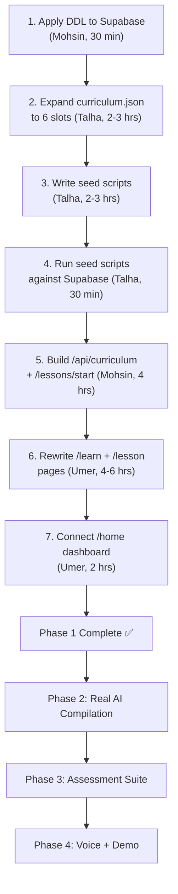

# Buslingo: Comprehensive Gap Analysis & Next-Phase Allocation

> **Generated:** July 11, 2026 · **Source of truth:** [buslingo_implementation_blueprint.md](file:///c:/Users/umerk/Downloads/buslingo/docs/buslingo_implementation_blueprint.md) cross-referenced against every physical file in the codebase.

---

## Executive Summary

The project has a **functional skeleton**: Supabase Auth works, the lesson runtime loop (theory → MCQ → voice → complete) renders correctly, the Director injects Targeted Fixes on 2nd MCQ failure, and the backend merge is complete. However, the **vast majority of the blueprint's substance is still mocked, stubbed, or missing entirely**. The curriculum has only 1 slot (needs 6+), seed scripts don't exist, the Supabase DDL has never been applied, prompts are skeleton-thin, the QnA route doesn't exist yet, voice is a UI shell with no real audio, and every dashboard/progress/vocabulary page runs on hardcoded mock data.

Below is an exhaustive breakdown of what exists, what's broken, and what's missing — followed by reallocated phases for all three team members.

---

## Section 1: What Actually Works Right Now

| Feature | Status | Notes |
|---|---|---|
| **Supabase Auth (sign-up/sign-in)** | ✅ Working | `@supabase/ssr` cookies, middleware route protection |
| **Lesson Runtime Loop** | ✅ Working | `GET /nodes/current` → render → `POST /attempt` → advance cursor |
| **Director Rule #1 (MCQ injection)** | ✅ Working | 2nd fail injects `targeted_fix` node at position n+0.5 |
| **Progress Bar (basic)** | ⚠️ Partial | Hardcoded `total_spine = 5` in frontend; should read from backend |
| **MCQ wrong-answer explanations** | ✅ Working | Dict lookup from compiled content, zero LLM calls |
| **QnA Drawer UI** | ✅ Working | `QnADrawer.tsx` renders on every lesson node |
| **Threaded lesson components** | ✅ Working | `ThreadedTheory`, `ThreadedMCQ`, `ThreadedVoice` render correctly |
| **Logout + Route protection** | ✅ Working | Hard redirect, `/onboarding` whitelisted |
| **Backend API structure** | ✅ Working | Routers: `auth`, `lessons`, `dashboard`, `srs`, `voice`, `progress`, `ops` |

---

## Section 2: What Is Broken or Partially Working

### 2.1 Lesson Page Hardcodes

> [!WARNING]
> [lesson/[id]/page.tsx](file:///c:/Users/umerk/Downloads/buslingo/frontend/app/lesson/%5Bid%5D/page.tsx) has **critical hardcodes** that must be fixed before the app can support multiple lessons.

| Issue | Location | Fix Required |
|---|---|---|
| `instanceId = "test"` hardcoded (line 33) | `page.tsx:33` | Must use `POST /api/lessons/{slot_id}/start` to get-or-create a real instance |
| `total_spine = 5` hardcoded for progress (line 87) | `page.tsx:87` | Read `total_spine` from the attempt response's `progress` object |
| `unitTitle="Unit 1 › Lesson 1"` hardcoded (line 188) | `page.tsx:188` | Fetch from the instance metadata |
| `lessonTitle="Business Greetings"` hardcoded (line 189) | `page.tsx:189` | Fetch from the instance metadata |
| No "Retry" button after wrong MCQ | `ThreadedMCQ.tsx` | Blueprint says user should be able to retry (up to 2 fails triggers injection) |

### 2.2 Session Report Card (complete page)

> [!WARNING]
> [complete/page.tsx](file:///c:/Users/umerk/Downloads/buslingo/frontend/app/lesson/complete/page.tsx) is **100% hardcoded mock data**.

- `+20 Tone`, `+15 Diplomacy`, `13 Day Consistency` → **baked-in static text**
- `AI Coach Summary` paragraph → **hardcoded string**
- `MOCK_FIXES` array → **3 static objects**
- "Start Micro-Drill" buttons → **non-functional**
- Should poll `GET /api/lesson-instances/{id}/summary` for the real AI coach summary
- Should show a confetti animation while waiting for the async summary

### 2.3 Curriculum/Learn Page

> [!IMPORTANT]
> [learn/page.tsx](file:///c:/Users/umerk/Downloads/buslingo/frontend/app/%28dashboard%29/learn/page.tsx) uses `mockCurriculum` with 4 fake units. Only 1 lesson is clickable.

- No connection to `GET /api/curriculum` endpoint
- No per-user unlock logic (completed / in_progress / available / locked)
- Clicking any lesson always goes to the same hardcoded "test" instance

### 2.4 Home Dashboard

> [!IMPORTANT]
> [home/page.tsx](file:///c:/Users/umerk/Downloads/buslingo/frontend/app/%28dashboard%29/home/page.tsx) is **entirely mocked**.

- "Good evening, Umer 👋" → hardcoded greeting
- Daily Goal `13 / 20 mins` → hardcoded
- Streak `12 Days` → hardcoded
- Weekly activity dots → hardcoded
- "Continue Lesson" card → hardcoded
- SRS Due count → not shown at all
- Should call `GET /api/dashboard` for all of this

### 2.5 Voice Exercise

- `ThreadedVoice.tsx` is a **UI shell only** — no microphone recording, no audio playback
- Backend `voice.py` has endpoints but `generate_voice_reply()` returns a **fake string** (line 117 of `client.py`)
- `generate_voice_score()` returns **hardcoded scores** (line 121 of `client.py`)
- TTS provider (`services/tts.py`) exists but uses **ElevenLabs only** — missing the Groq TTS → browser fallback chain

---

## Section 3: What Is Completely Missing

### 3.1 Database (DDL Never Applied)

> [!CAUTION]
> The `schema.sql` file exists but has **never been executed** against the Supabase database. Without these tables, the entire Postgres-backed runtime (attempts, stats, SRS, streaks, XP) will crash.

**Missing tables:** `user_profiles`, `units`, `lesson_slots`, `lesson_instances`, `lesson_nodes`, `lesson_branches`, `node_attempts`, `stat_events`, `user_stats`, `activity_days`, `xp_events`, `vocab_terms`, `srs_cards`, `srs_reviews`, `llm_failures`

**Also missing from `schema.sql`:** The `qna_exchanges` table specified in §5.5 of the blueprint.

### 3.2 Curriculum Content

> [!CAUTION]
> [curriculum.json](file:///c:/Users/umerk/Downloads/buslingo/backend/app/content/curriculum.json) has only **1 unit with 1 lesson slot**. The blueprint requires **at minimum 2 units × 3 lessons = 6 slots** for a demoable product.

Current content:
```json
{ "units": [{ "id": 1, "title": "Unit 1: The First Impression", "slots": [{ "slot_key": "u1l1", ... }] }] }
```

Missing: `node_template` per slot (beginner/intermediate/advanced spine patterns), the remaining 5+ slots, the full canonical `concept_tags` list at the top level.

### 3.3 Seed Scripts (`scripts/` directory)

The entire `scripts/` directory **does not exist**. The blueprint requires:

| Script | Purpose | Status |
|---|---|---|
| `scripts/seed_curriculum.py` | Parse `curriculum.json` → upsert `units` + `lesson_slots` into Postgres | ❌ Missing |
| `scripts/seed_fixtures.py` | Insert a hand-written ready lesson for testing without AI | ❌ Missing |
| `scripts/seed_vocab.py` | Generate vocab definitions + context sentences → `vocab_terms` table | ❌ Missing |
| `scripts/ingest_book.py` | Extract structured data from a textbook into `curriculum.json` | ❌ Missing (deferred, OK) |

### 3.4 Missing API Routes

| Blueprint Route | Status | Notes |
|---|---|---|
| `GET /api/me` | ❌ Missing | Profile + settings + streak + XP for TopNav |
| `PATCH /api/me/settings` | ❌ Missing | coach_voice, timezone, daily_goal_min, level |
| `GET /api/curriculum` | ❌ Missing | Units → slots with per-user lock status |
| `GET /api/progress` | ❌ Missing | Radar axes + weekly activity data |
| `POST /api/lessons/{slot_id}/start` | ❌ Missing | The proper get-or-create instance flow with 202 compiling |
| `POST /api/lesson-instances/{id}/complete` | ⚠️ Partial | Exists but doesn't fire background compile for next lesson or coach summary |
| `GET /api/lesson-instances/{id}/summary` | ❌ Missing | Poll endpoint for async AI coach summary |
| `POST /api/lesson-instances/{id}/qna` | ❌ Missing | The Ask-Anything live QnA route |
| `POST /api/transcribe` | ⚠️ Partial | `client.py` has Whisper code but no dedicated route |

### 3.5 AI Layer Gaps

| Component | File Exists? | Functional? | Gap |
|---|---|---|---|
| `generate_validated()` repair loop | ✅ `utils/llm.py` | ✅ Yes | Working correctly |
| Compile prompt | ✅ `prompts/compile.py` | ⚠️ Skeleton | Missing: literal JSON example, HARD RULES, `node_template` instruction, canonical tag list injection, weakness-bias instruction |
| Grade prompt | ✅ `prompts/grade.py` | ⚠️ Skeleton | Missing: anchored score criteria, coach_voice variants, `suggested_rewrite` instruction |
| QnA prompt | ✅ `prompts/qna.py` | ⚠️ Skeleton | Missing: scope policy (core/adjacent/off_topic behavior), bridge_line instruction, never-scold rule |
| Coach summary prompt | ✅ `prompts/coach.py` | ⚠️ Skeleton | Missing: `CoachSummary` schema instruction, `next_lesson_focus`, `prioritized_fixes` format |
| Voice system prompt | ❌ Missing | ❌ | Blueprint §7.2: persona, max 2 sentences, objective steering, coach_voice variants |
| `compiler.py` real compile | ✅ Exists | ⚠️ Partial | Has a `_fallback_bundle()` but the real `compile_lesson()` hasn't been validated end-to-end with Groq |

### 3.6 Frontend Missing Features

| Feature | Status |
|---|---|
| **Cold-start "Personalizing your lesson…" animation** | ❌ Missing |
| **Error boundaries for compile failures** | ❌ Missing |
| **Radar Chart connected to live backend data** | ❌ Mocked |
| **Writing Assessment submission + rubric display** | ❌ Not wired to backend |
| **SRS Flashcard review UI connected to API** | ❌ Mocked with static data |
| **Walkie-talkie voice recording (MediaRecorder)** | ❌ Missing |
| **Voice audio playback (TTS response)** | ❌ Missing |
| **Dashboard connected to `GET /api/dashboard`** | ❌ Mocked |
| **Settings page connected to `PATCH /api/me/settings`** | ❌ Mocked |
| **Vocabulary page connected to SRS API** | ❌ Mocked |
| **Confetti animation on lesson complete** | ❌ Missing |
| **Onboarding → actually sets user profile (level, goals)** | ❌ Not connected |

---

## Section 4: Reallocated Phase Plan

> [!IMPORTANT]
> The original phases assumed parallel development. Now that the backend merge is complete and everyone is on the same codebase, we can work more efficiently. Umer gets **more work** as requested. All phases below are in strict build order.

---

### Phase 1: Foundation (Database + Curriculum + Seed) — **~2-3 days**

> **Exit criterion:** A user can click through 6 different lessons from the curriculum map, with content coming from Postgres. Zero AI code runs.

#### Mohsin (Backend Architect)
- [ ] Apply the full DDL (`schema.sql` + `qna_exchanges` table) to the live Supabase database
- [ ] Add RLS policies (`user_id = auth.uid()`) on all user-owned tables
- [ ] Build `POST /api/lessons/{slot_id}/start` — get-or-create instance, return 202 if compiling
- [ ] Build `GET /api/lesson-instances/{id}` — status + progress (compile poll + crash resume)
- [ ] Build `POST /api/lesson-instances/{id}/complete` — full transaction: status update, idempotent XP, activity/streak upsert, fire background compile for next slot
- [ ] Fix `POST /attempt` to use real `spine_progress()` calculation from DB (not hardcoded)

#### Talha (AI Brain & RAG)
- [ ] Create `scripts/seed_curriculum.py` — parse `curriculum.json` → upsert `units` + `lesson_slots`
- [ ] Create `scripts/seed_fixtures.py` — insert 6 hand-written lesson bundles (2 units × 3 lessons) with status `ready` into the database for testing
- [ ] Expand `curriculum.json` to 2 units × 3 lessons with proper `node_template`, full `concept_tags`, vocabulary, grammar, and examples per slot
- [ ] Create `scripts/seed_vocab.py` — populate `vocab_terms` table with terms from curriculum
- [ ] Design the Curriculum RAG architecture

#### Umer (Frontend & Backend Read APIs)
- [ ] **Build `GET /api/curriculum`** — returns units → slots with per-user status
- [ ] **Build `GET /api/me` and `PATCH /api/me/settings`**
- [ ] **Rewrite `/learn` page** — replace `mockCurriculum` with `fetch('GET /api/curriculum')`, render real unlock states, each lesson links to `/lesson/{slot_key}`
- [ ] **Rewrite `/lesson/[id]/page.tsx`** — remove `instanceId = "test"`, call `POST /api/lessons/{slot_id}/start`, handle 202 compiling status with a "Personalizing your lesson…" animation, read `total_spine` from backend
- [ ] **Build cold-start animation** — poll `GET /api/lesson-instances/{id}` every 1.5s while `status === "compiling"`, show animated loading screen
- [ ] **Connect `/home` dashboard** — replace all mocked data with `fetch('GET /api/dashboard')` (greeting, daily goal, streak, weekly dots, continue lesson card, SRS due count)
- [ ] **Connect Settings page** — wire level, coach_voice, daily_goal dropdowns to `PATCH /api/me/settings`
- [ ] **Connect Onboarding** — after onboarding completes, call `POST /api/auth/sync` to create the user profile with the chosen level and goals
- [ ] **Add MCQ Retry button** — allow re-attempt after wrong answer (Director fires on 2nd fail)
- [ ] **Fix progress bar** — read `completed_spine` and `total_spine` from attempt response

---

### Phase 2: Brain (Real AI Compilation + Director) — **~2-3 days**

> **Exit criterion:** Lessons are AI-generated and personalized by level. Quick Fix fires on 2nd MCQ failure with real compiled branches. Fixtures deleted.

#### Mohsin (Backend)
- [ ] Wire `compile_lesson_background()` end-to-end: call `generate_validated(LessonBundle)` → write `lesson_nodes` + `lesson_branches` rows in one transaction → set status `ready`
- [ ] Handle `StructuredOutputError`: set status `failed`; `POST /start` retries once if status is `failed` or `compiling` older than 90s
- [ ] Wire `POST /lesson-instances/{id}/complete` to fire background compile for the next slot
- [ ] Ensure Director rule writes `stat_events` and updates `user_stats` EMA inside the attempt transaction

#### Talha (AI/Infrastructure)
- [ ] **Rewrite `prompts/compile.py`** to match blueprint §6.4 exactly: literal JSON example, HARD RULES block, `node_template` instruction, canonical tag enforcement, weakness-bias instruction
- [ ] Validate `generate_validated()` repair loop works with Groq free tier (test with intentionally bad schemas)
- [ ] Write `prompts/voice.py` — the voice system prompt per §7.2: persona, max 2 sentences, objective steering, coach_voice variants
- [ ] Test compile end-to-end: slot context → Groq → `LessonBundle` validates → persisted → frontend loads

#### Umer (Frontend)
- [ ] **Build error boundaries** — if compile fails, show "We couldn't build this lesson, tap to retry" instead of a crash
- [ ] **Validate Targeted Fix rendering** — ensure `TargetedFixCard.tsx` renders beautifully when the backend returns an `injected_node` with real compiled content (not just the demo Quick Fix)
- [ ] **Test the full loop** — sign up → onboarding → first lesson compiles → complete → next lesson auto-compiles → resume after browser close

---

### Phase 3: Assessment (Writing, QnA, Radar, SRS) — **~3-4 days**

> **Exit criterion:** `/progress` radar moves after a session. QnA drawer gives live AI answers. Writing gets graded. SRS reviews work.

#### Mohsin (Backend DB/Architecture)
- [ ] Build `POST /api/lesson-instances/{id}/qna` — full route per §5.5: call `generate_validated(QnAResponse)`, persist to `qna_exchanges`, track consecutive off_topic for productive-redirect, implement Director rule #2 (question cluster → injection)
- [ ] Build `GET /api/progress` — `{radar: {6 axes from user_stats}, activity: [{day, minutes, xp}] x 7}`
- [ ] Build `GET /api/lesson-instances/{id}/summary` — poll endpoint for async coach summary
- [ ] Wire `POST /api/lesson-instances/{id}/complete` to fire `generate_coach_summary()` as a background task
- [ ] Build `POST /api/transcribe` as a standalone utility route (audio blob → Groq Whisper → text)

#### Talha (AI Brain & Core RAG)
- [ ] **Rewrite `prompts/grade.py`** to match blueprint §8: literal JSON example, anchored score criteria (9-10/5-6/0-4), `suggested_rewrite` instruction, `detected_concept_errors` with canonical tags, per-`coach_voice` delivery
- [ ] **Rewrite `prompts/qna.py`** to match blueprint §5.5: scope policy (core = full answer, adjacent = brief + bridge_line, off_topic = friendly + bridge), never-scold rule, grounding in current node + slot context
- [ ] **Rewrite `prompts/coach.py`** to match blueprint §8: `CoachSummary` schema with `overall_scores`, `summary_markdown`, `prioritized_fixes: [{concept_tag, why, example_from_user}]`, `next_lesson_focus`
- [ ] Build the `CoachSummary` Pydantic schema in `models/schema.py`
- [ ] Build RAG Data Pipeline (chunking PDF/Docs, generating embeddings via Groq/OpenAI, and inserting into `pgvector`)

#### Umer (Frontend & Backend Read APIs)
- [ ] **Build RAG Retrieval API (`POST /api/qna/semantic-search`)** — receive query, create embedding, perform Cosine Similarity search on `pgvector`, return relevant chunks
- [ ] **Connect Radar Chart** — replace mock data in `/progress` with `fetch('GET /api/progress')`, wire 6 axes (writing, listening, grammar, vocabulary, tone, fluency)
- [ ] **Connect Writing Assessment** — when user submits draft on writing node, call `POST /api/lesson-instances/{id}/writing/submit`, show loading spinner (2-4s), render the returned `WritingRubric` (tone/clarity/structure scores + suggested rewrite + overall comment)
- [ ] **Wire QnA Drawer to backend** — `QnADrawer.tsx` should call `POST /api/lesson-instances/{id}/qna` with the user's question, display the markdown answer, handle `scope` display (show bridge_line for adjacent/off_topic), render injected_node if returned
- [ ] **Connect SRS Vocabulary page** — replace `mockVocabulary` with `fetch('GET /api/srs/due')`, wire "Got It" / "Still Learning" buttons to `POST /api/srs/reviews`, show due count
- [ ] **Build Session Report Card (dynamic)** — replace `MOCK_FIXES` with polling `GET /api/lesson-instances/{id}/summary`, show confetti animation while `status === "pending"`, render real `prioritized_fixes` and `summary_markdown` when ready
- [ ] **Connect Activity Heatmap** — wire to real `activity` data from `/api/progress`

---

### Phase 4: Voice + Polish + Demo — **~3-4 days**

> **Exit criterion:** Full session start-to-confetti with voice. Demo video recorded.

#### Mohsin (Backend DB/Architecture)
- [ ] Finalize `POST /api/lesson-instances/{id}/voice/turn` — wire to real Groq Whisper + LLM reply (not the fake string)
- [ ] Finalize `POST /api/lesson-instances/{id}/voice/finish` — advance cursor, fire async `score_voice_session()` background task
- [ ] Wire `score_voice_session()` to `generate_validated(VoiceScore)` → fan out to `stat_events`

#### Talha (AI/Infrastructure)
- [ ] **Build the TTS provider interface** — `TTS_PROVIDER=groq|browser|elevenlabs` with runtime selection per §7.5
- [ ] Wire `services/tts.py` to support all 3 backends: Groq TTS (first choice), browser speechSynthesis fallback (frontend), ElevenLabs (demo only)
- [ ] Wire `generate_voice_reply()` in `client.py` to use the real Groq 70B with the voice system prompt (replace the fake string)
- [ ] Wire `generate_voice_score()` in `client.py` to use `generate_validated(VoiceScore)` (replace hardcoded scores)
- [ ] Set up basic CI/CD: GitHub Actions to run `next build` and `pytest` on every commit

#### Umer (Frontend & Backend Read APIs)
- [ ] **Build `GET /api/dashboard` aggregate endpoint** — ensure it returns real `daily_goal`, `streak`, `next_lesson`, `srs_due_count`
- [ ] **Build Walkie-Talkie Voice UI** — tap-to-talk button using `MediaRecorder` API, record webm/opus blob, send to `POST /api/lesson-instances/{id}/voice/turn`, receive and play back `reply_audio_b64` (or fall back to `speechSynthesis` if null), show waveform/visualizer animation
- [ ] **Voice node objectives** — display the scenario, AI persona, and objectives list; check off objectives as `objectives_hit` comes back from each turn; auto-wrap when all met or turn_count ≥ 12
- [ ] **Confetti + coach summary on complete** — celebratory animation, poll for async summary, render when ready
- [ ] **Final polish pass** — responsive layout testing, micro-animation tuning, loading state consistency, edge case handling (network errors, empty states)
- [ ] **README + scale-up deltas** — document V2 voice WebSocket design, Redis migration path, semantic QnA cache, pgvector RAG — as described in blueprint §9.5

---

## Section 5: Quick Reference — File Ownership After Reallocation

| Area | Owner | Key Files |
|---|---|---|
| Database DDL + RLS | Mohsin | `backend/schema.sql`, Supabase SQL Editor |
| API Routes (Stateful) | Mohsin | `backend/api/lessons.py`, `backend/api/auth.py` |
| API Routes (Read-Only) | Umer | `backend/api/dashboard.py`, `backend/api/me.py`, `backend/api/curriculum.py` |
| Pydantic Schemas | Mohsin + Talha | `backend/models/schema.py` |
| AI Prompts | Talha | `backend/prompts/*.py` |
| AI Client + generate_validated | Talha | `backend/utils/llm.py`, `backend/app/ai/*.py` |
| Seed Scripts | Talha | `scripts/seed_*.py` |
| Curriculum Content | Talha + Umer (review) | `backend/app/content/curriculum.json` |
| TTS + Voice Pipeline | Talha | `backend/services/tts.py`, `backend/services/voice_pipeline.py` |
| All Frontend Pages | Umer | `frontend/app/**/*.tsx` |
| All Frontend Components | Umer | `frontend/components/**/*.tsx` |
| Middleware + Auth | Umer | `frontend/middleware.ts`, `frontend/utils/supabase/*` |

---

## Section 6: Priority Order (What to Do First)



> [!TIP]
> **The single most important first step is applying the DDL to Supabase.** Without those tables, nothing else works. Mohsin should do this immediately — it's a 30-minute copy-paste job in the Supabase SQL Editor.
